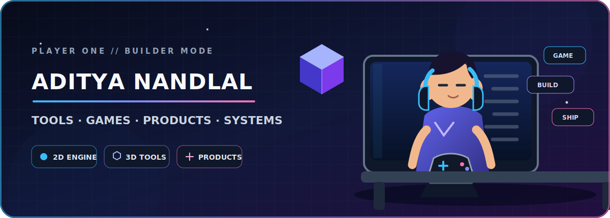

<p align="center">
  
</p>

<h1 align="center">Hey, I'm Aditya Nandlal 👋</h1>

<p align="center">
  <strong>Multi-product builder crafting developer tools, games, creative runtimes, and self-hosted systems.</strong>
</p>

<p align="center">
  I enjoy turning ambitious ideas into real products—from rendering engines and headless platforms
  to gaming experiments, desktop tools, automation, and infrastructure.
</p>

<p align="center">
  <a href="https://wovvtech.site">Website</a>
  ·
  <a href="https://github.com/bestmaa?tab=repositories">Projects</a>
  ·
  <a href="https://github.com/bestmaa?tab=stars">Open-source interests</a>
</p>

## Builder mode

- 🎮 **Games & interactive systems** — 2D rendering, gameplay experiments, visual tooling, and creative runtimes.
- 🧰 **Developer tools** — products that make building, automation, and local workflows more powerful.
- 🏗️ **Multi-product platforms** — reusable foundations for launching and operating multiple products.
- ☁️ **Self-hosted infrastructure** — Docker, deployment platforms, reverse proxies, and production operations.
- 🤖 **AI-assisted creation** — practical agent workflows across code, design, 2D, and 3D environments.

## Featured builds

<table>
  <tr>
    <td width="50%" valign="top">
      <h3><a href="https://github.com/bestmaa/raw2d">Raw2D</a></h3>
      <p>A low-level JavaScript and TypeScript 2D rendering engine with a transparent, modular pipeline.</p>
      <p><code>TypeScript</code> <code>Canvas</code> <code>WebGL2</code> <code>Game Tech</code></p>
    </td>
    <td width="50%" valign="top">
      <h3><a href="https://github.com/bestmaa/apiagex">Apiagex</a></h3>
      <p>A headless CMS and API platform for shipping content-driven products and isolated multi-tenant systems.</p>
      <p><code>TypeScript</code> <code>Headless CMS</code> <code>APIs</code> <code>Multi-tenant</code></p>
    </td>
  </tr>
  <tr>
    <td width="50%" valign="top">
      <h3><a href="https://github.com/bestmaa/codex-blender">Codex Blender</a></h3>
      <p>A local bridge for controlling Blender from Codex or a terminal using structured commands.</p>
      <p><code>Python</code> <code>Blender</code> <code>3D</code> <code>Creative Tools</code></p>
    </td>
    <td width="50%" valign="top">
      <h3><a href="https://github.com/bestmaa/qunta">Qunta</a></h3>
      <p>A desktop coding-agent product built around a private LLM gateway and a local Codex runtime.</p>
      <p><code>TypeScript</code> <code>Rust</code> <code>Tauri</code> <code>AI Agents</code></p>
    </td>
  </tr>
</table>

## Game lab

Gaming is part of the long-term product direction—not just a side badge. I am building the foundations for:

- browser-first 2D experiences and reusable engine modules;
- scene, animation, interaction, sprite, text, and editor tooling;
- 3D creation workflows powered by Blender automation;
- small playable experiments that can grow into complete products.

The goal is simple: **build the engine, build the tools, then build the worlds.**

## Working stack

### Product & UI

<p>
  
  
  
  
  
  
  
</p>

### Backend & data

<p>
  
  
  
  
</p>

### Desktop, systems & delivery

<p>
  
  
  
  
  
  
  
  
</p>

### Games, graphics & creative tools

<p>
  
  
  
  
</p>

## Build philosophy

```text
Understand the system → design the foundation → ship the product → verify the reality
```

I value modular architecture, readable internals, practical automation, and products that can survive outside a demo environment.

<p align="center">
  <strong>BUILD · PLAY · SHIP · REPEAT</strong>
</p>
